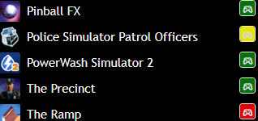
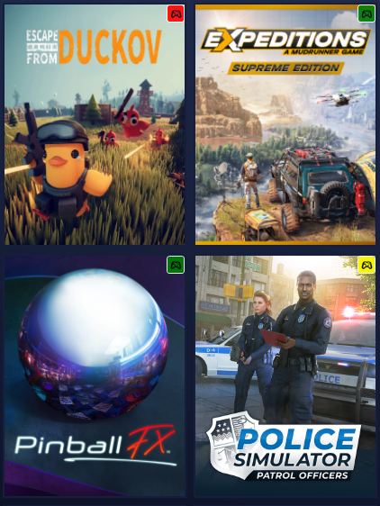
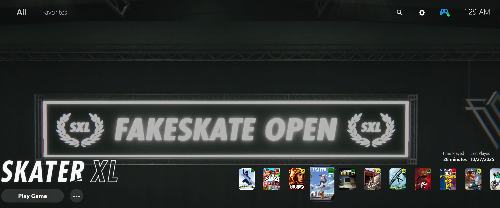

# Playnite Controller Compatibility Plugin (v1.0.2)


**Detail View**


**Grid View**


**Modified TrailerLovers Fullscreen Theme**


A Playnite plugin that provides controller compatibility detection and management, similar to Steam's controller compatibility system.


## What's New in v1.0.2
- Overlay restoration is now lightweight and only triggers on view change or compatibility/controller updates
- Removed heavy polling and layout event hooks for improved performance
- Overlays persist reliably when switching between grid and detail views


> **Theme Compatibility:**
>
> This plugin is confirmed to work with the [TrailerLovers](https://github.com/blooderscrew1/TrailerLovers) fullscreen theme. It *should* work with other Playnite themes, but this has not been confirmed.

## Features

### 🎮 Controller Detection
- Automatically detects connected controllers (Xbox, PlayStation, Nintendo, Generic)
- Real-time controller status monitoring
- Support for multiple controllers simultaneously

### 🎯 Game Compatibility Database  
- Maintains compatibility ratings for games:
  - ✅ **Full Controller Support** - Native gamepad support
  - 🎮 **Partial Controller Support** - Some limitations or workarounds needed
  - ❌ **No Controller Support** - Keyboard/mouse only


## Installation

### Recommended (Easy)
1. Download the latest `.pext` file from [Releases](https://github.com/DreadHeadHippy/Controller-Compatibility/releases).
2. Open Playnite.
3. Go to **Extensions → Install extension**.
4. Select the downloaded `.pext` file.
5. Restart Playnite.

### Advanced (Manual Build)
1. Run `build.bat` to compile the plugin.
2. Copy the contents of `bin\Release\net462\` to:
  ```
  %AppData%\Playnite\Extensions\ControllerCompatibility\
  ```
3. Restart Playnite.
4. Enable the plugin in Settings → Extensions.

### What You'll See
- **Controller Status**: Top panel shows connected controllers
- **Game Overlays**: Look for colored badges on game tiles in your library (top-right corner if in 'grid view')
- **Context Menus**: Right-click games for compatibility options
- **Visual Feedback**: Badges appear based on controller compatibility

### Test Data
The plugin includes test compatibility data for popular games. Connect a controller to see the full effect!

## Development

### Requirements
- .NET Framework 4.6.2 or higher
- Playnite SDK
- Visual Studio 2019+ or VS Code with C# extension

### Building
```bash
dotnet build
```

### Testing
```bash
dotnet test
```

## Contributing

1. Fork the repository
2. Create a feature branch
3. Make your changes
4. Add tests for new functionality
5. Submit a pull request

## License

This project is licensed under the MIT License - see the [LICENSE](LICENSE) file for details.


## Support

This plugin is open source and free to use.
If you find it helpful and would like to support development, you can donate via [Ko-fi](https://ko-fi.com/dreadheadhippy).
Donations are appreciated but never required!

## Acknowledgments

- Inspired by Steam's controller compatibility system
- Built for the amazing [Playnite](https://playnite.link/) game library manager